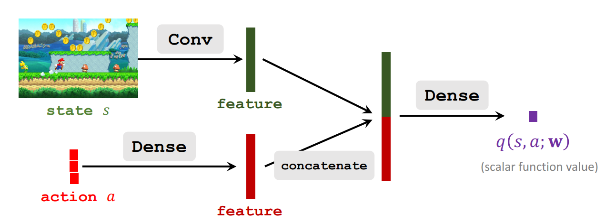
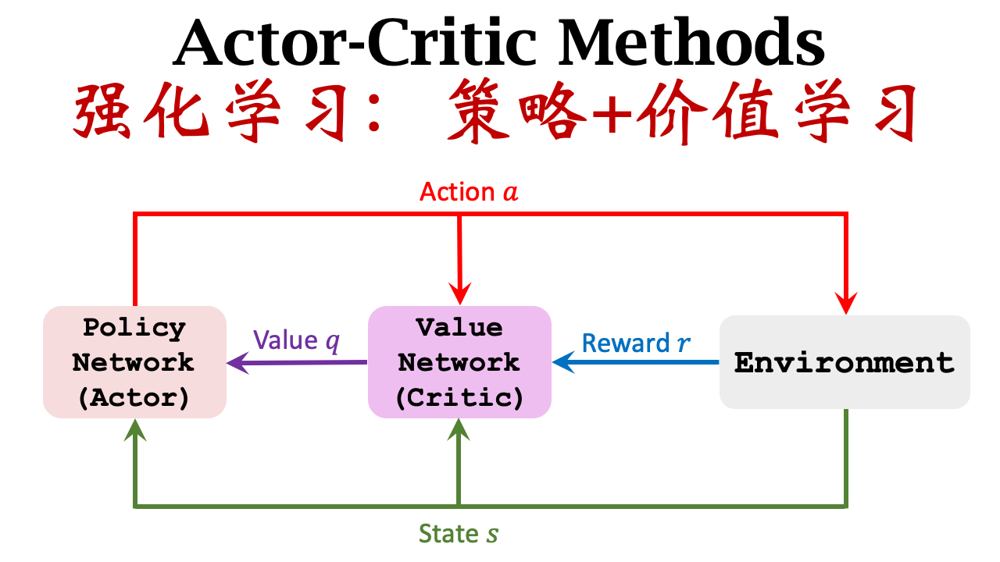

# Actor-Critic算法
Actor是策略网络用来控制agcent运动，可以看作是运动员；Critic是价值网络用来给动作打分，可以看作是裁判。这个算法相当于把前面学习到的价值学习和策略学习进行结合的一种方法。

## Policy Network(Actor)
就是前面说的策略函数，可以记作：$\pi(a|s;\theta)$，这个可以用来看作做运动的运动员。

上图就是前面所说的策略函数的作用。

## Value Network(Critic)
这个也就是前面所说的价值学习，可以记作：$q(s,a;w)$，这个可以用来看作给运动员动作打分的裁判。

## Actor-Critic Method
上面两种网络可以同时进行训练共享参数，也可以单独训练。同时进行训练就叫做Actor-Critic方法。上面两个网络中我们需要训练两个参数$\theta$和$w$。这个方法的示意图如下所示：

这种方法可以简单的理解为：运动员做出一个动作Action(a)之后，裁判网络(critical)根据当前的State(s)生成一个价值Value(q)。然后裁判把分数告诉运动员，运动员知道分数之后就能想办法改进自己了。但是运动员改进只是根据裁判的分数，如果裁判的水平较低，可能不会有特别大的进步，所以我们还要让裁判不断跟新他的打分能力。所以裁判要靠奖励r来提高打分水平。
## 总结算法
这个算法的大致实现思路是：

* 首先是观测到一个旧的动作$s_t$，然后根据策略网络$a \sim \pi(\cdot |s_t;\theta_t)$，来计算概率分布，然后根据计算出来的概率分布随机抽取出一个状态$a_t$。
* 然后执行动作$a_t$，然后环境会告诉我们新的状态$s_{t+1}$和奖励$r_t$。
* 拿新的状态$s_{t+1}$作为输入。然后用策略网络计算出新的概率，然后计算出新的动作$\hat{a}_{t+1}$，这个动作只是一个假想的动作，拿来算一下q值。
* 然后算两次两次价值网络的输出$q_t=q(s_t,a_t;w_t)$和$q_{t+1}=q(s_{t+1,\hat{a}_{t+1}};w_t)$，$\hat{a}_{t+1}$这个动作并不会真正的执行，只是这里用来计算。
* 然后在来计算TD error：$\delta_t=q_t-(r_t+\gamma\cdot q_{t+1})$
* 对价值网络求导，$d_{w,t}=\frac{\partial q(s_t,a_t;w)}{\partial w}|_{w=w_t}$
* 更新价值网络：$w_{t+1}=w_t-\alpha \cdot \delta_t \cdot d_{w,t}$
* 对策略网络求导：$d_{\theta,t}=\frac{\partial{ln(\pi(a_t|s_t,\theta))}}{\partial \theta} |_{\theta=\theta_t}$
* 更新策略网络：$\theta_{t+1}=\theta_t+\beta \cdot q_t \cdot d_{\theta,t}$